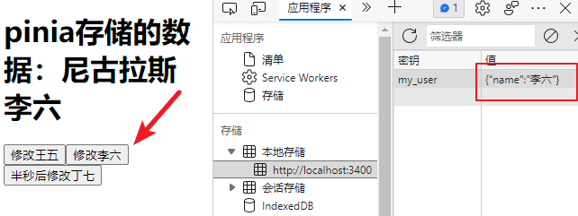
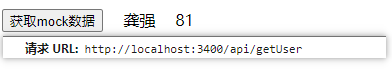
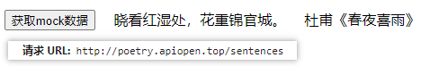
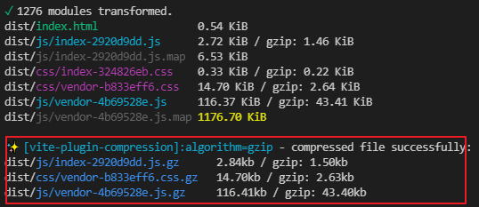

## Vue 3 + Vite的学习

### 1、🔧基本构建

#### 项目创建

使用vite创建了项目（本项目为vue3.0）

使用 NPM:

```sh
npm init vite@latest
```

使用 Yarn:

```sh
yarn create vite
```

`运行`项目

```sh
npm run dev
```

#### script setup语法

[单文件组件  | Vue.js (vuejs.org)](https://v3.cn.vuejs.org/api/sfc-script-setup.html)

:star:<script setup> 是编译语法糖

script中的代码会被编译为setup中的内容

`不同`

- 不用return声明的变量、函数...
- 不用声明导入的组件...
- 在 <script setup> 中必须使用 defineProps 和 defineEmits API 来声明 props 和 emits
- ...

### 2、✨路由的简单使用

### 创建路由

```js
//src/router/index.js
import { createRouter, createWebHashHistory } from 'vue-router'

// 1. 定义路由组件.
import Pinia from '../components/Pinia.vue'

// 2. 定义一些路由
const routes = [
  { path: '/pinia', component: Pinia },
]

// 3. 创建路由实例并传递 `routes` 配置
export const router = createRouter({
  history: createWebHashHistory(),
  routes,
})
```

### 使用路由

```vue
//app.vue

<script setup>
import { useRouter, useRoute } from 'vue-router'

const router = useRouter()
const route = useRoute()

//router.push('/pinia')
</script>
```

### 其他

#### vite.config.js的配置

```js
import { defineConfig } from 'vite'
const { resolve } = require('path') //必须要引入resolve
import vue from '@vitejs/plugin-vue'

export default defineConfig({
  plugins: [vue()],
  server: {
    port: 3400,
    open: true,
  },
  resolve: {
	alias: {
	  '@': resolve(__dirname, 'src'), //把src改为@
	},
  },
})
```

### 3、✨Pinia的简单使用

#### 创建pinia store

```js
//src/store/index.js
import { createPinia } from 'pinia'

export const store = createPinia()
```

#### 引入store

```js
//main.js
import { createApp } from 'vue'
import App from './App.vue'
import { router } from './router'
import { store } from './store'

createApp(App).use(router).use(store).mount('#app')
```

#### 创建user

`pinia的优点，actions可以放异步操作和同步操作`

```js
import { defineStore } from 'pinia'

export const useUserStore = defineStore({
  id: 'user', // id必填，且需要唯一
  state: () => {
    return {
      name: '张三',
    }
  },
  getters: {
    fullName() {
      return `尼古拉斯 ${this.name}`
    },
  },
  // pinia 可以在actions中同时操作同步或异步
  actions: {
    // 同步修改
    updateName(name) {
      this.name = name
    },
    // 异步修改
    asChangeName(name) {
      setTimeout(() => {
        this.name = name
      }, 500);
    },
  },
})

```

#### 引入和使用

```vue
//components/pinia.vue

<script>
import { computed, ref } from 'vue'
import { useUserStore } from '../store/user.js'  //引入
export default {
  name: 'Pinia',
  setup() {
    const userStore = useUserStore()
    // const userName = computed(() => `尼古拉斯 ${userStore.name}`)  //这个使用的state
    const userName = computed(() => userStore.fullName)	//这个使用的getters

    const btnClick1 = () => {
      userStore.updateName('王五')
    }
    const btnClick2 = () => {
      userStore.updateName('李六')
    }
    const btnClick3 = () => {
      userStore.asChangeName('丁七')	//这个是异步
    }

    return {
      userName,
      btnClick1,
      btnClick2,
      btnClick3,
    }
  },
}
</script>
```

### 4、✨Pinia的数据持久化

#### 安装

```sh
npm i pinia-plugin-persist --save
```

#### 修改pinia store

```js
import { createPinia } from 'pinia'
import piniaPluginPersist from 'pinia-plugin-persist'

export const store = createPinia().use(piniaPluginPersist)
```

#### 持久化

在对应的 store 里开启 persist 即可开启持久化

```js
import { defineStore } from 'pinia'

export const useUserStore = defineStore({
  id: 'user', // id必填，且需要唯一
  state: () => {
    return {
      name: '张三',
    }
  },

  // 开启数据缓存
  persist: {
    enabled: true,//默认存储sessionStorage中，以id: 'user'作为key
    //也可以在 strategies 里自定义 key 值，并将存放位置由 sessionStorage 改为 localStorage。
    strategies: [
      {
        key: 'my_user',
        storage: localStorage,
        paths: ['name'] //指定要持久化的state属性
      }
    ]
  },
})

```



### 5、✨vite的一些配置项

#### 打包配置公共路径

默认为/，修改为./可以解决服务器路径问题

```js
//vite.config.js
export default defineConfig({
  base: './',
})
```

#### 图片别名配置

```js
//vite.config.js
export default defineConfig({
  resolve: {
	alias: {
	  '@': resolve(__dirname, 'src'), //把src改为@
	  '/img': './src/assets/img'	//图片的别名配置
	},
  },
})
```

#### 打包自动移除log

```js
//vite.config.js
export default defineConfig({
  build: {
    minify: 'terser',
    terserOptions: {
	  compress: {
	    //生产环境移除console
	    drop_console: true,
	    drop_debugger: true
	  }
    }
  },
})
```

#### element-plus自动按需引入

```sh
npm install element-plus --save

npm install -D unplugin-vue-components unplugin-auto-import
```

```js
// vite.config.js
import AutoImport from 'unplugin-auto-import/vite'
import Components from 'unplugin-vue-components/vite'
import { ElementPlusResolver } from 'unplugin-vue-components/resolvers'

export default {
  plugins: [
    // ...
    AutoImport({
      resolvers: [ElementPlusResolver()],
    }),
    Components({
      resolvers: [ElementPlusResolver()],
    }),
  ],
}
```

#### Mock的配置

```sh
npm i vite-plugin-mock mockjs  -D
```

```js
export default {
  plugins: [
    viteMockServe({
      mockPath: './src/mock',
      supportTs: true, // 打开后，可以读取 ts 文件模块。 请注意，打开后将无法监视.js 文件。
      watchFiles: true, // 监视文件更改
    })
  ],
}
```

```ts
//./src/mock/index.ts
// test.js 仅做示例: 通过GET请求返回一个对象数组，包含人名和年龄
import { MockMethod } from 'vite-plugin-mock'
import { mock } from 'mockjs'

function randomData() {
  return mock({
    name: '@cname',
    'from|1-100': 100
  })
}

export default [
  {
    url: "/api/getUser",
    method: "get",
    response: () => {
      return {
        code: 200,
        message: "ok",
        data: randomData()
      };
    }
  }
] as MockMethod[]
```

返回的数据实例

```json
{"code":200,"message":"ok","data":{"name":"孙明","from":52}}
```

#### proxy前端配置代理

```js
export default {
  server: {
    port: 3400,
	open: true,
	proxy: {
	// 代理配置
	  //'/cors': 'http://127.0.0.1:8080/',  //两种都可以
	  '/cors': {
		target: 'http://127.0.0.1:8080/',
		changeOrigin: true,
		rewrite: (path) => path.replace(/^\/cors/, '')
	  },
	},
  },
}
```

```js
async function getMockData() {
  //调用node接口，跨域，在vite.config中配置跨域
  const { data } = await axios.post('/cors')  
  console.log(data);
}
```

#### env环境变量的配置

```js
//.env.development	//最外层和src同级
VITE_BASE_API=/api/getUser
```

```js
//.env.production	//最外层和src同级
VITE_BASE_API=http://poetry.apiopen.top/sentences
```

分别对应开发时与打包时





#### gzip

```sh
npm i vite-plugin-compression -D
```

```js
// vite.config.js
import viteCompression from 'vite-plugin-compression';

export default {
  plugins: [
    viteCompression(),
  ],
}
```



#### eslint、prettier代码格式化的配置

```js
//./src/.eslintrc.js
module.exports = {
  root: true,
  env: {
    browser: true,
    node: true,
    es6: true,
  },
  extends: [
    'plugin:vue/vue3-essential',
    'eslint:recommended',
    '@vue/typescript/recommended',
    '@vue/prettier',
    // '@vue/prettier/@typescript-eslint',
  ],
  parserOptions: {
    ecmaVersion: 2020,
    sourceType: 'module',
  },
  rules: {
    'prettier/prettier': 'error',
    '@typescript-eslint/no-explicit-any': ['off'],
    '@typescript-eslint/indent': ['off'],
    '@typescript-eslint/no-unused-vars': ['error'],
  },
  globals: {
    defineProps: 'readonly',
    defineEmits: 'readonly',
    defineComponent: 'readonly',
    defineExpose: 'readonly',
  },
}
```

```js
//./src/prettierrc.js
module.exports = {
    printWidth: 80,
    tabWidth: 2,
    useTabs: false,
    singleQuote: true,
    semi: false,
    trailingComma: 'es5',
    bracketSpacing: true,
    jsxBracketSameLine: false,
    arrowParens: 'avoid',
    endOfLine: 'auto',
}
```

### 6、🦄 迁移至typescript
迁移至typescript
