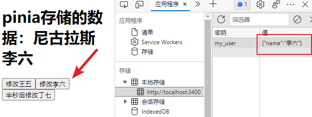

## Vue 3 + Vite的学习

### 1、🔧基本构建

#### 部署地址
在线浏览：https://zhangwh754.github.io/vue3.0study/

#### 项目创建

使用vite创建了项目（本项目为vue3.0）

使用 NPM:

```sh
npm init vite@latest
```

使用 Yarn:

```sh
yarn create vite
```

`运行`项目

```sh
npm run dev
```

#### script setup语法

[单文件组件  | Vue.js (vuejs.org)](https://v3.cn.vuejs.org/api/sfc-script-setup.html)

:star:<script setup> 是编译语法糖

script中的代码会被编译为setup中的内容

`不同`

- 不用return声明的变量、函数...
- 不用声明导入的组件...
- 在 <script setup> 中必须使用 defineProps 和 defineEmits API 来声明 props 和 emits
- ...

### 2、✨路由的简单使用

### 创建路由

```js
//src/router/index.js
import { createRouter, createWebHashHistory } from 'vue-router'

// 1. 定义路由组件.
import About from '../components/About.vue'

// 2. 定义一些路由
const routes = [
  { path: '/about', component: About },
]

// 3. 创建路由实例并传递 `routes` 配置
export const router = createRouter({
  history: createWebHashHistory(),
  routes,
})
```

### 使用路由

```vue
//app.vue

<script setup>
import { useRouter, useRoute } from 'vue-router'

const router = useRouter()
const route = useRoute()

//router.push('/about')
</script>
```

### 其他

#### vite.config.js的配置

```js
import { defineConfig } from 'vite'
const { resolve } = require('path') //必须要引入resolve
import vue from '@vitejs/plugin-vue'

export default defineConfig({
  plugins: [vue()],
  server: {
    port: 3400,
    open: true,
  },
  "resolve.alias": {
    '/@/': resolve(__dirname, '@'), //把src改为@
  },
})
```

### 3、✨Pinia的简单使用

#### 创建pinia store

```js
//src/store/index.js
import { createPinia } from 'pinia'

export const store = createPinia()
```

#### 引入store

```js
//main.js
import { createApp } from 'vue'
import App from './App.vue'
import { router } from './router'
import { store } from './store'

createApp(App).use(router).use(store).mount('#app')
```

#### 创建user

`pinia的优点，actions可以放异步操作和同步操作`

```js
import { defineStore } from 'pinia'

export const useUserStore = defineStore({
  id: 'user', // id必填，且需要唯一
  state: () => {
    return {
      name: '张三',
    }
  },
  getters: {
    fullName() {
      return `尼古拉斯 ${this.name}`
    },
  },
  // pinia 可以在actions中同时操作同步或异步
  actions: {
    // 同步修改
    updateName(name) {
      this.name = name
    },
    // 异步修改
    asChangeName(name) {
      setTimeout(() => {
        this.name = name
      }, 500);
    },
  },
})

```

#### 引入和使用

```vue
//components/about.vue

<script>
import { computed, ref } from 'vue'
import { useUserStore } from '../store/user.js'  //引入
export default {
  name: 'About',
  setup() {
    const userStore = useUserStore()
    // const userName = computed(() => `尼古拉斯 ${userStore.name}`)  //这个使用的state
    const userName = computed(() => userStore.fullName)	//这个使用的getters

    const btnClick1 = () => {
      userStore.updateName('王五')
    }
    const btnClick2 = () => {
      userStore.updateName('李六')
    }
    const btnClick3 = () => {
      userStore.asChangeName('丁七')	//这个是异步
    }

    return {
      userName,
      btnClick1,
      btnClick2,
      btnClick3,
    }
  },
}
</script>
```

### 4、✨Pinia的数据持久化

#### 安装

```sh
npm i pinia-plugin-persist --save
```

#### 修改pinia store

```js
import { createPinia } from 'pinia'
import piniaPluginPersist from 'pinia-plugin-persist'

export const store = createPinia().use(piniaPluginPersist)
```

#### 持久化

在对应的 store 里开启 persist 即可开启持久化

```js
import { defineStore } from 'pinia'

export const useUserStore = defineStore({
  id: 'user', // id必填，且需要唯一
  state: () => {
    return {
      name: '张三',
    }
  },

  // 开启数据缓存
  persist: {
    enabled: true,//默认存储sessionStorage中，以id: 'user'作为key
    //也可以在 strategies 里自定义 key 值，并将存放位置由 sessionStorage 改为 localStorage。
    strategies: [
      {
        key: 'my_user',
        storage: localStorage,
        paths: ['name'] //指定要持久化的state属性
      }
    ]
  },
})

```



